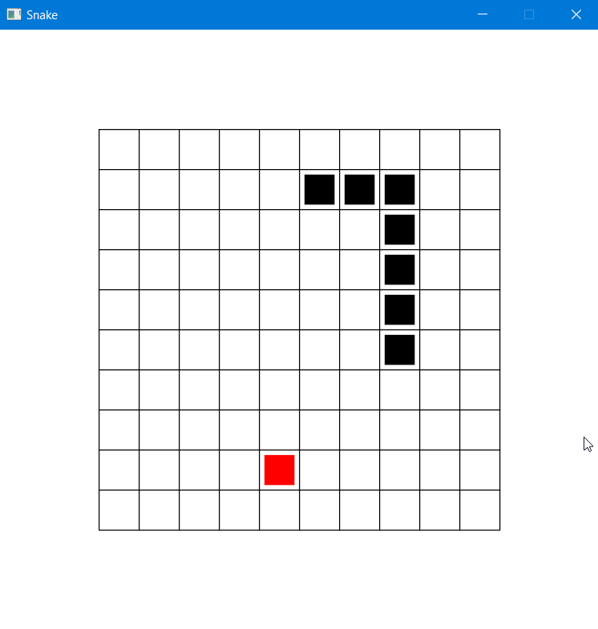
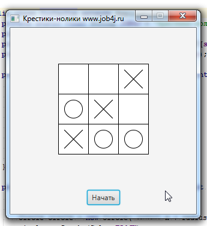
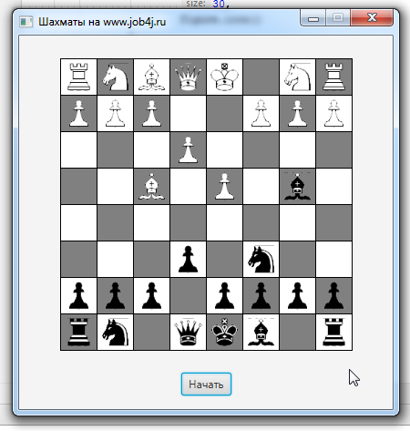

# Welcome to Java Mastery!

[Join our chat on Discord!](https://discord.gg/VEKvWyzt)

Welcome to "Java Mastery" – your ultimate chat for mastering Java programming! Whether you're a beginner starting from scratch or an experienced developer looking to deepen your knowledge, our chat community has you covered. Join us for in-depth discussions, coding challenges, best practices, and the latest updates in the world of Java. Let's code, learn, and grow together!

## About This Project

This project showcases how to use JavaFX in an object-oriented programming (OOP) style through a series of popular game examples. Dive into the code for classic games such as Snake, Chess, and Tic-Tac-Toe, and see how JavaFX can bring these games to life.

If you have any suggestions or encounter any issues with this project, please create a new GitHub issue [here](https://github.com/peterarsentev/games_oop_javafx/issues).

## Game Examples

### Snake

### Tic-Tac-Toe

### Chess

## Upcoming Features

- SeaBattle
- Pac-Man
- Tetris

Stay tuned for more updates and improvements!
