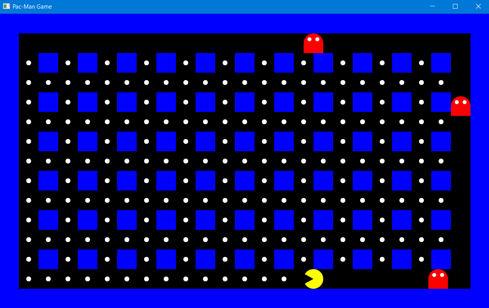

## About This Project

This project showcases how to use JavaFX in an object-oriented programming (OOP) style through a series of popular game examples. Dive into the code for classic games such as Snake, Chess, and Tic-Tac-Toe, and see how JavaFX can bring these games to life.

If you have any suggestions or encounter any issues with this project, please create a new GitHub issue [here](https://github.com/peterarsentev/games_oop_javafx/issues).

## Game Examples

### Pac-Man

### Snake

### Tic-Tac-Toe

### Chess

## Upcoming Features

- SeaBattle
- Tetris

Stay tuned for more updates and improvements!

---

Let me know if there are any other changes you'd like to make!